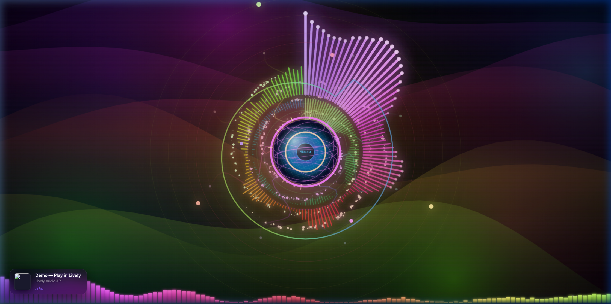

# 🌌 Nebula v3 — Living Album Art (Lively Wallpaper)

An epic, high-performance, audio-reactive 3D nebula wallpaper for **Lively Wallpaper**. Features dynamic Spotify Now Playing color matching, 3D textured album cover projection, vocal-range beat pulses, and 5-layer mouse parallax.



---

## ✨ Features

- 🎵 **Spotify / Windows Media Integration (`--system-nowplaying`)**: Displays song title, artist, album name, and real-time audio playback animation.
- 🎨 **Dynamic Album Art Color Matching**: Automatically extracts the dominant vibrant hue from the active album cover and transforms the entire nebula theme instantly.
- 🔮 **3D Textured Album Orb**: Clips and projects the active album art into a 3D sphere with normal lens shading, specular glass dome glare, metallic tech bevel frame, and 3D wireframe mesh layer.
- 🗣️ **Vocal & Frequency Detection**: Tracks vocal frequencies (200Hz - 3kHz) with a dedicated pulsing vocal wave ring and audio-reactive energy tendrils.
- 💥 **Beat Shockwaves & Radial Explosions**: Dynamic lasers, lightning arcs, corner flashes, and particle bursts triggered on bass hits.
- 🖱️ **5-Layer Mouse Parallax**: Smooth momentum-based 3D depth tilt across stars, nebula clouds, aurora borealis bands, spectrum rings, and core orb.
- 🌌 **Aurora Borealis & Galaxy Spiral**: Multi-layered wave curtains and 600+ rotating s-arm stars.

---

## 🚀 How to Install in Lively Wallpaper

### Option 1 — Drag & Drop `.zip` (Easiest)
1. Download [`Nebula_v3_Living_Album_Art.zip`](https://github.com/alikokrtv/nebula-lively-wallpaper/archive/refs/heads/main.zip).
2. Open **Lively Wallpaper**.
3. Drag & drop the `.zip` file directly into the Lively window.
4. Set as wallpaper and enjoy!

### Option 2 — Local Folder / Clone
1. Clone this repository:
   ```bash
   git clone https://github.com/alikokrtv/nebula-lively-wallpaper.git
   ```
2. Open **Lively Wallpaper** → Click **`+` (Add Wallpaper)** → **Browse**.
3. Select `index.html` from the cloned directory.

---

## ⚙️ Requirements & Spotify Setup

For Now Playing & Album Art color matching:
1. Open **Spotify** → **Settings** → **Display options**.
2. Turn on **"Show desktop overlay when using media keys"**.

---

## 📄 License
[MIT](LICENSE) © [alikokrtv](https://github.com/alikokrtv)
